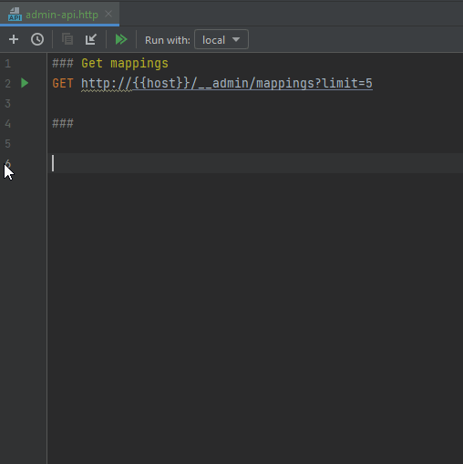

# WireMock Admin API

## Live templates for HTTP Client

A handful of live templates are available for the [HTTP Client plugin](https://www.jetbrains.com/help/idea/http-client-in-product-code-editor.html),
so that requests sent to the WireMock Admin API can be added to the currently edited .http or .rest file.

The templates are prefixed with **wm** for easier access, and incorporate a `{{host}}` variable that has to be defined beforehand in an environment
configuration file, or simply overwritten with a specific host/domain.

The templates can be found under <kbd>Settings</kbd> > <kbd>Editor</kbd> > <kbd>Live Templates</kbd> > <kbd>WireMock</kbd>. 

