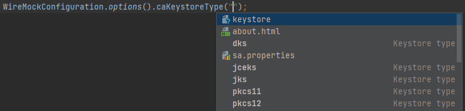
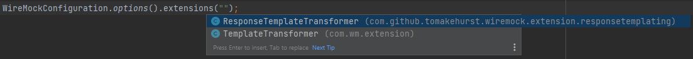
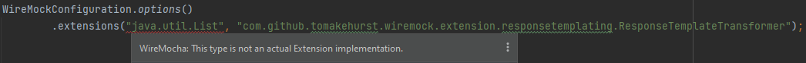

# Configuration

The features here are all related to how `WireMockConfiguration` instances are set up.

## Keystore

### caKeystoreType() argument completion

 

`WireMockConfiguration#caKeystoreType()` under the hood uses this type to create `java.security.KeyStore`s via various means.

This code completion supplies the possible keystore type values upon invoking the Ctrl+Space menu. The items are placed near the top
of the suggestion list (weighing them to the absolute top is not perfect yet).

The suggested values are based on the list provided by the [Java Security Standard Algorithm Names - KeyStore types](https://docs.oracle.com/en/java/javase/15/docs/specs/security/standard-names.html#keystore-types)
documentation.

## Extensions

Extension implementations in WireMock must implement the `com.github.tomakehurst.wiremock.extension.Extension` interface.
Then, when configuring `WireMockConfiguration` with said extensions, these are the ones accepted by the `WireMockConfiguration#extensions()` method.

### extensions() code completion

 

To simplify code completion, only classes that satisfy the following criteria are shown when completing String arguments in `extensions()`:
- implement `com.github.tomakehurst.wiremock.extension.Extension`
- not interfaces and not abstract classes
- not anonymous classes

### extensions() criteria inspections

 

String arguments of `extensions()` are validated and reported if they do not implement the aforementioned `Extensions` interface.

If the specified fully qualified name is a valid identifier, but for some reason the actual class cannot be located in the project or the project libraries,
no issue is reported.

