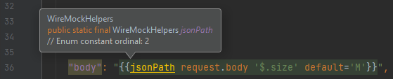
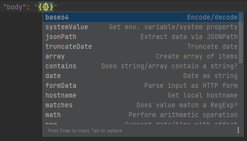
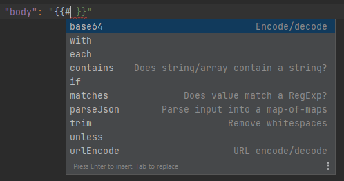
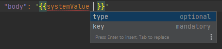
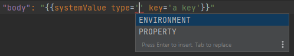

# Handlebars Helpers

This document details the various integrations that are added to WireMock's custom Handlebars helpers. 

## Validation of Handlebars helpers

  

Performs validation on custom Handlebars helpers provided by WireMock.

Currently, it performs the following checks:
- Minimum and maximum number of parameters in simple mustaches, sub-expressions and block helpers.
- Whether a hash name is supported by the given helper, or if there is any hash supported by a helper at all. **Quick fix**: to remove the unsupported hash, or all hashes, respectively.
- Incorrect hash values.
- Default hash values. **Quick fix**: to remove the hash.
- Undefined mandatory hashes. **Quick fix**: to add missing mandatory hashes. 
- Whether a helper is supposed to be used as a block helper.

These rules are based both on WireMock's [Response Templating](https://wiremock.org/docs/response-templating/) documentation and on the actual implementation of those helpers.

| Helper          | # of params | # of params in block (no value means same as in non-blocks) | Hashes                                                                                                                        | Can be block helper? |
|-----------------|-------------|-----------------------------------------------------------------|-------------------------------------------------------------------------------------------------------------------------------|----------------------|
| [xPath]         | 2           |                                                                 | -                                                                                                                             | -                    |
| [soapXPath]     | 2           |                                                                 | -                                                                                                                             | -                    |
| [jsonPath]      | 2           |                                                                 | *default*                                                                                                                     | -                    |
| [randomValue]   | 0           |                                                                 | *type* - default value: 'ALPHANUMERIC' *length* - default value: 36 *uppercase* - default value: false    | -                    |
| [hostname]      | 0           |                                                                 | -                                                                                                                             | -                    |
| [date]          | 1           |                                                                 | *offset*, *timezone*, *format*                                                                                                | -                    |
| [now]           | 0           |                                                                 | *offset*, *timezone*, *format*                                                                                                | -                    |
| [parseDate]     | 1           |                                                                 | *format*                                                                                                                      | -                    |
| [truncateDate]  | 2           |                                                                 | -                                                                                                                             | -                    |
| [trim]          | 1           | 0                                                               | -                                                                                                                             | Yes                  |
| [base64]        | 1           | 0                                                               | *decode*, *padding*                                                                                                           | Yes                  |
| [urlEncode]     | 1           | 0                                                               | *decode* *encoding* - default value: 'utf-8'                                                                          | Yes                  |
| [formData]      | 1-2         |                                                                 | *urlDecode* *encoding* - default value: 'utf-8'                                                                       | -                    |
| [regexExtract]  | 2-3         |                                                                 | *default*                                                                                                                     | -                    |
| [size]          | 1           |                                                                 | -                                                                                                                             | -                    |
| [pickRandom]    | 1-INF       |                                                                 | -                                                                                                                             | -                    |
| [randomInt]     | 0           |                                                                 | *lower*, *upper*                                                                                                              | -                    |
| [randomDecimal] | 0           |                                                                 | *lower*, *upper*                                                                                                              | -                    |
| [range]         | 2           |                                                                 | -                                                                                                                             | -                    |
| [array]         | 0-INF       |                                                                 | -                                                                                                                             | -                    |
| [parseJson]     | 1-2         | 0-1                                                             | -                                                                                                                             | Yes                  |
| [matches]       | 2           |                                                                 | -                                                                                                                             | Yes                  |
| [contains]      | 2           |                                                                 | -                                                                                                                             | Yes                  |
| [math]          | 3           |                                                                 | -                                                                                                                             | -                    |
| [systemValue]   | 0           |                                                                 | *type* - default value: 'ENVIRONMENT', - allowed values: 'ENVIRONMENT', 'PROPERTY' **key** - non-empty string | -                    |

**Notes:**
- The number of params include the so-called `context` parameter too.
- Hash names in italics are optional ones, while hashes in bold are mandatory ones.
- Separate handling of param count for block helpers is necessary, since in that case the context is not defined as the first parameter of the mustache,
instead as the body of the block helper.

**Other resources:**
- [WireMockHelpers.java]() on GitHub

## Navigation to the implementations of helpers

 

With this functionality, users are able to navigate to the implementations of WireMock's custom Handlebars helpers
via Ctrl+Click or similar actions. References are provided for helper name elements, and resolve
- either to `com.github.tomakehurst.wiremock.extension.responsetemplating.helpers.SystemValueHelper`
- or to enum constants of `com.github.tomakehurst.wiremock.extension.responsetemplating.helpers.WireMockHelpers`

This differentiation is needed because there is no enum constant in `WireMockHelpers` for `SystemValueHelper`.

This also makes it possible that, if you search for the usages of e.g. `WireMockHelpers#jsonPath`,
all its usages are returned from, for instance, WireMock mapping files. 

**Notes**:
- All helpers, listed in the previous section, are supported.
- `{{` (simple mustache), `{{#` (block helper), `{{{` (HTML escaping), `{{{{` (raw block) are all supported.
- Subexpressions are currently not supported.

## Code completion

 

Code completion is available for WireMock's custom Handlebars helpers:
- **helper names**
- **hash names** of helpers that support hashes
- **string literal hash values** where a list of applicable values can be determined

Helper name items also include short descriptions of them about their purposes:

When a block helper `{{#` is code completed, only helpers that can be used as block helpers are suggested.

Hash names include the fact if they are mandatory or optional:

Hash value items doesn't have additional contextual information:

NOTE: Completion of non-string literal hash values and simple parameters are not supported at the moment.

[xPath]: https://github.com/wiremock/wiremock/blob/master/src/main/java/com/github/tomakehurst/wiremock/extension/responsetemplating/helpers/HandlebarsXPathHelper.java
[soapXPath]: https://github.com/wiremock/wiremock/blob/master/src/main/java/com/github/tomakehurst/wiremock/extension/responsetemplating/helpers/HandlebarsSoapHelper.java
[jsonPath]: https://github.com/wiremock/wiremock/blob/master/src/main/java/com/github/tomakehurst/wiremock/extension/responsetemplating/helpers/HandlebarsJsonPathHelper.java
[randomValue]: https://github.com/wiremock/wiremock/blob/master/src/main/java/com/github/tomakehurst/wiremock/extension/responsetemplating/helpers/HandlebarsRandomValuesHelper.java
[hostname]: https://github.com/wiremock/wiremock/blob/master/src/main/java/com/github/tomakehurst/wiremock/extension/responsetemplating/helpers/HostnameHelper.java
[date]: https://github.com/wiremock/wiremock/blob/master/src/main/java/com/github/tomakehurst/wiremock/extension/responsetemplating/helpers/HandlebarsCurrentDateHelper.java
[now]: https://github.com/wiremock/wiremock/blob/master/src/main/java/com/github/tomakehurst/wiremock/extension/responsetemplating/helpers/HandlebarsCurrentDateHelper.java
[parseDate]: https://github.com/wiremock/wiremock/blob/master/src/main/java/com/github/tomakehurst/wiremock/extension/responsetemplating/helpers/ParseDateHelper.java
[truncateDate]: https://github.com/wiremock/wiremock/blob/master/src/main/java/com/github/tomakehurst/wiremock/extension/responsetemplating/helpers/TruncateDateTimeHelper.java
[trim]: https://github.com/wiremock/wiremock/blob/master/src/main/java/com/github/tomakehurst/wiremock/extension/responsetemplating/helpers/StringTrimHelper.java
[base64]: https://github.com/wiremock/wiremock/blob/master/src/main/java/com/github/tomakehurst/wiremock/extension/responsetemplating/helpers/Base64Helper.java
[urlEncode]: https://github.com/wiremock/wiremock/blob/master/src/main/java/com/github/tomakehurst/wiremock/extension/responsetemplating/helpers/UrlEncodingHelper.java
[formData]: https://github.com/wiremock/wiremock/blob/master/src/main/java/com/github/tomakehurst/wiremock/extension/responsetemplating/helpers/FormDataHelper.java
[regexExtract]: https://github.com/wiremock/wiremock/blob/master/src/main/java/com/github/tomakehurst/wiremock/extension/responsetemplating/helpers/RegexExtractHelper.java 
[size]: https://github.com/wiremock/wiremock/blob/master/src/main/java/com/github/tomakehurst/wiremock/extension/responsetemplating/helpers/SizeHelper.java 
[pickRandom]: https://github.com/wiremock/wiremock/blob/master/src/main/java/com/github/tomakehurst/wiremock/extension/responsetemplating/helpers/PickRandomHelper.java
[randomInt]: https://github.com/wiremock/wiremock/blob/master/src/main/java/com/github/tomakehurst/wiremock/extension/responsetemplating/helpers/RandomIntHelper.java
[randomDecimal]: https://github.com/wiremock/wiremock/blob/master/src/main/java/com/github/tomakehurst/wiremock/extension/responsetemplating/helpers/RandomDecimalHelper.java
[range]: https://github.com/wiremock/wiremock/blob/master/src/main/java/com/github/tomakehurst/wiremock/extension/responsetemplating/helpers/RangeHelper.java
[array]: https://github.com/wiremock/wiremock/blob/master/src/main/java/com/github/tomakehurst/wiremock/extension/responsetemplating/helpers/ArrayHelper.java
[parseJson]: https://github.com/wiremock/wiremock/blob/master/src/main/java/com/github/tomakehurst/wiremock/extension/responsetemplating/helpers/ParseJsonHelper.java
[matches]: https://github.com/wiremock/wiremock/blob/master/src/main/java/com/github/tomakehurst/wiremock/extension/responsetemplating/helpers/MatchesRegexHelper.java 
[contains]: https://github.com/wiremock/wiremock/blob/master/src/main/java/com/github/tomakehurst/wiremock/extension/responsetemplating/helpers/ContainsHelper.java
[math]: https://github.com/wiremock/wiremock/blob/master/src/main/java/com/github/tomakehurst/wiremock/extension/responsetemplating/helpers/MathsHelper.java 
[systemValue]: https://github.com/wiremock/wiremock/blob/master/src/main/java/com/github/tomakehurst/wiremock/extension/responsetemplating/helpers/SystemValueHelper.java 
