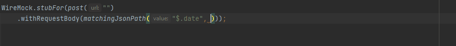

# Live Templates

## Between date-time "matcher"

 

Since no 'between' date-time matcher exists in WireMock, this live template helps to create and insert the `before().and(after())` code snippet.

