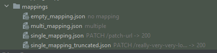
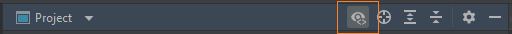
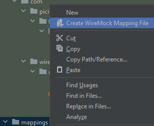
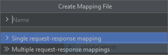

# Mapping files

<!-- TOC -->
* [JSON schema](#json-schema)
* [Request-response information on Project View file nodes](#request-response-information-on-project-view-file-nodes)
* [Create mapping file from template](#create-mapping-file-from-template)
<!-- TOC -->

## JSON schema

 

A JSON schema is bound to JSON mapping files, which automatically provides validation and code completion.
It works both for single- and multi-mapping files.

The schema is based on the original WireMock schemas in
the [WireMock GitHub repository](https://github.com/wiremock/wiremock/tree/master/src/main/resources/swagger/schemas).

NOTE: the validation and auto-completion features are not implemented in this plugin, but in the IntelliJ platform
itself.
It simply provides the configuration for the IntelliJ platform, so that it knows what conditions must a file meet to
assign a certain schema file to it.

## Request-response information on Project View file nodes

 

To provide a basic overview of what data stub mapping files hold, this node decorator adds some basic information to
stub mapping file nodes in the Project View.



It currently provides information on three parts:
- request method: the value of the `request.method` property
- request url: the value of, any one of, the following properties first found: `request.url`, `request.urlPath`, `request.urlPattern`, `request.urlPathPattern` 
- response status: the value of the `response.status` property

Mapping files are put into three different categories:
- no mapping
- single mapping
- multiple mappings

The way and cases which category and what information is displayed also aims to uncover potentially erroneous mapping files or missing properties. 

### No mapping

A mapping file is considered empty when:

- the file is completely empty,
- the root-level value is not an object, for instance the content is an array: `["some", "array"]`,
- there is no `mappings` or `request` top-level property found, for instance: `{}` or `{ "id": "..." }`,
- there is a `mappings` property, but there is no `request` property inside, in any of its child objects:
```json
{
    "mappings": [
        {
          "response": { ... }
        }
    ]
}
```

In this case, the file is decorated with the *no mapping* text:

The presence/absence of the `response` property is ignored. The file is considered empty regardless.

### Multiple mappings

A mapping file is considered having multiple mappings when:

- there is a `mappings` property, and there is more than one `request` property inside, in any of its child objects:
```json
{
    "mappings": [
        {
          "request": { ... }
          "response": { ... },
        },
        {
          "request": { ... }
        }
    ]
}
```

The presence/absence of the `response` property is ignored. The file is considered multiple regardless. This might
change in the future.

In this case, the file is decorated with the *multiple* text:

### Single mapping

A mapping file is considered having a single mapping when:

- there is one request-response mapping in the file:
```json
{
    "request": {
        "method": "PATCH",
        "url": "/patch-url"
    },
    "response": {
      "status": 300
    }
}
```
- there is a `mappings` property, and there is only one `request` property inside:
```json
{
    "mappings": [
        {
            "request": {
                "method": "PATCH",
                "url": "/patch-url"
            },
            "response": {
                "status": 300
            }
        }
    ]
}
```
- there is a `mappings` property, there are multiple mapping objects in it, but only one of them has a `request` property:
```json
{
    "mappings": [
        {
            "response": { ... }
        },
        {
            "request": {
                "method": "PUT",
                "url": "/put-url"
            },
            "response": {
              "status": 302
            }
        }
    ]
}
```

In this case, the file is decorated with the following texts, based on the input values:

| `request.method` | `request.url*`               | `response.status` | Node decoration text               |
|------------------|------------------------------|-------------------|------------------------------------|
| ""               | ""                           | ""                | ""                                 |
| ""               | ""                           | 200               | -> 200                             |
| ""               | "/url"                       | ""                | /url                               |
| ""               | "/url"                       | 200               | /url -> 200                        |
| PUT              | ""                           | ""                | PUT                                |
| PUT              | ""                           | 200               | PUT -> 200                         |
| PUT              | "/url"                       | ""                | PUT /url                           |
| PUT              | "/url"                       | 200               | PUT /url -> 200                    |
| PUT              | "/really-very-very-long-url" | 200               | PUT /really-very-very-lo... -> 200 |

The last example shows that url values are truncated at 20 characters to keep the node decoration concise.

### Enable/disable node decoration

There is also a toolbar action in the Project View to enable/disable the node decoration. By default it is turned off.

It saves the enabled/disable state per project.



### Indexing

The displayed data is coming from a custom index implementation, so if you have the node decoration enabled when the IDE
or a project launches, and you have some mapping folders open, the files inside won't be visible until the IDE finishes indexing.

If you don't use the node decoration feature, it is recommended to disable it to minimize its performance/resource impact on the IDE. 

## Unwrap single stub mapping in multi-mapping definitions

 

This inspection can report `mappings` properties in JSON mapping files that contain only a single stub mapping.
In that case, having the `mappings` property specified is not necessary, the stub mapping object itself can be the sole
content of the mapping file.

It also provides a quick fix that unwraps the stub mapping, and essentially removes the wrapping around the stub mapping.

Whether that child mapping has any content doesn't matter, the property is reported regardless. However, nothing
is reported when `mappings` has a `meta` sibling property specified, since that one doesn't have a counterpart in
the individual stub mapping schema.

**Example:**

```json
{
  "mappings": [ //"mappings" propery name is reported
    {
      "request": { ... },
      "response": { ... }
    }
  ]
}
```

becomes

```json
{
  "request": { ... },
  "response": { ... }
}
```

## Create mapping file from template

 

The **Create WireMock Mapping File** action is available in the Project view context menu on directories
called `mappings` and on subdirectories of them.
It uses File Templates to pre-populate mapping files with predefined contents.



You can select from two templates (both editable in <kbd>Settings</kbd> > <kbd>Editor</kbd> > <kbd>File and Code
Templates</kbd> > <kbd>Files</kbd>).
The provided file name must include the *.json* extension too.



- single request-response mapping

```json
{
  "request": {
    "method": "GET",
    "url": "/"
  },
  "response": {
    "status": 200
  }
}
```

- multiple request-response mappings

```json
{
  "mappings": [
    {
      "request": {
        "method": "GET",
        "url": "/"
      },
      "response": {
        "status": 200
      }
    },
    {
      "request": {
        "method": "GET",
        "url": "/"
      },
      "response": {
        "status": 200
      }
    }
  ]
}
```