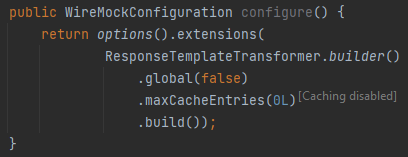

# Response templating

## Inlay hint for ResponseTemplateTransformer.Builder#maxCacheEntries

 

According to the [Template caching](http://wiremock.org/docs/response-templating/#template-caching) documentation for `maxCacheEntries()`:
> Setting the limit to 0 will disable caching completely

Thus, when 0L is provided as argument to `maxCacheEntries()`, an inlay hint is displayed to inform users that caching is disabled.

NOTE: In case of constants as arguments, no hint is displayed, since possibly they have a name that signals that caching is disabled.
An inlay hint would provide no useful information then.
