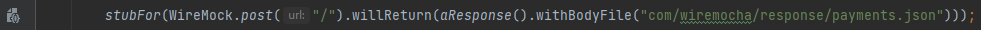
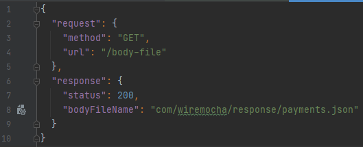
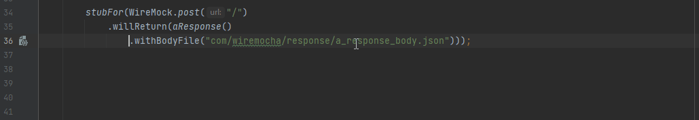
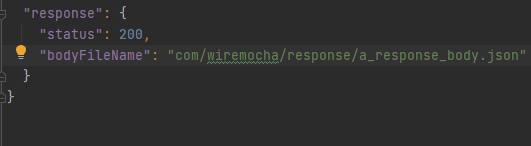

# Stubbing

Features related to WireMock [stubbing](http://wiremock.org/docs/stubbing/).

## Simplify response related stubbing

 

There are many convenience methods available in the `WireMock` class to simplify and shorten stubbing of responses in various ways.

This inspection reports cases when response specific stubbing may be replaced with a shorter version (a convenience method) of it,
also providing a quick fix for each replacement.

Since the form `WireMock.aResponse().withStatus(...)` (for status codes that do not have convenience methods) might be more descriptive than using `WireMock.status(...)`,
there is a flag in the inspection's settings whether to report such cases. It is disabled by default.

**Status 2xx**

```java
From: aResponse().withStatus(200)
  to: ok()

From: aResponse().withStatus(200).withBody(body)
      ok().withBody(body)
  to: ok(body)

From: aResponse().withStatus(200).withHeader(CONTENT_TYPE, contentType).withBody(body)
      ok().withBody(body).withHeader(CONTENT_TYPE, contentType)
      ok(body).withHeader(CONTENT_TYPE, contentType)
  to: okForContentType(contentType, body)

From: aResponse().withStatus(201)
  to: created()

From: aResponse().withStatus(204)
  to: noContent()

From: okForContentType("application/json", body)
  to: okJson(body)

From: okForContentType("application/xml", body)
  to: okXml(body)

From: okForContentType("text/xml", body)
  to: okTextXml(body)
```

**Status 3xx**

```java
From: aResponse().withStatus(301).withHeader("Location", location)
  to: permanentRedirect(location)

From: aResponse().withStatus(302).withHeader("Location", location)
  to: temporaryRedirect(location)

From: aResponse().withStatus(303).withHeader("Location", location)
  to: seeOther(location)
```

**Status 4xx**

```java
From: aResponse().withStatus(400)
  to: badRequest()

From: aResponse().withStatus(401)
  to: unauthorized()

From: aResponse().withStatus(403)
  to: forbidden()

From: aResponse().withStatus(404)
  to: notFound()

From: aResponse().withStatus(422)
  to: badRequestEntity()
```

**Status 5xx**

```java
From: aResponse().withStatus(500)
  to: serverError()

From: aResponse().withStatus(503)
  to: serviceUnavailable()
```

**Other**

```java
From: aResponse().withStatus(status)
  to: status(status)
```

## Duplicate configuration in response definitions

 

Currently, this inspection reports incorrect duplicate header configuration in `ResponseDefinitionBuilder` call chains. When a header name is specified in
multiple `.withHeader()` calls, that header's value would be overridden.

```java
//Both "Accept-Language" string literals are highlighted
stubFor(get("/").willReturn(aResponse().withHeader("Accept-Language", "HU").with("Content-Length", "1024").withHeader("Accept-Language", "JP")));

//Both ACCEPT_LANGUAGE constant expressions are highlighted
stubFor(get("/").willReturn(aResponse().withHeader(ACCEPT_LANGUAGE, "HU").with("Content-Length", "1024").withHeader(ACCEPT_LANGUAGE, "JP")));
```

## Incorrect configuration in response definitions

 

This inspection is an umbrella for reporting any issue that is deemed incorrect when configuring stub response definitions.

Currently, it reports `ResponseDefinitionBuilder#withBodyFile()` calls whose path parameters start with the `/` symbol.
According to the [WireMock Stubbing documentation](http://wiremock.org/docs/stubbing/):
> Body file paths should always be relative i.e. not have a leading /

**Java**

```java
public class ATest {
    private static final String INCORRECT_PATH = "/incorrect/path";

    void method() {
        stubFor(post("/").willReturn(aResponse().withBodyFile("/incorrect/path")));
        stubFor(post("/").willReturn(aResponse().withBodyFile(INCORRECT_PATH)));
    }
}
```

**JSON**

```json
{
  "request": { ... },
  "response": {
    "status": 200,
    "bodyFileName": "/incorrect/path"
  }
}
```

## Gutter icon for response definition body file paths

 

`ResponseDefinitionBuilder#withBodyFile()` takes argument a relative path (by default relative to `src/test/resources/__files`,
see [Specifying the response body](http://wiremock.org/docs/stubbing/#specifying-the-response-body)) to a file providing the contents of the response body.

Similarly, in the JSON mapping representation, the `response.bodyFileName` property behaves the same.

To mark the location of such files, a line marker/gutter icon is added if the path can be resolved, to which the file reference is always added.

**Java**



**JSON**



## Convert between various response body definition modes

WireMock provides multiple ways to specify response bodies, so naturally there can be various ways of conversion between these approaches.

The aim of the following intentions is to help with those conversions.

NOTE: the validation whether a JSON file is an actual mapping file is currently determined by whether it is located in a folder called **mappings**.
A more sophisticated validation may come in a later phase. 

### Inline the contents of a body file as a body string

 

The intentions below are available when:
- the caret is at the `withBodyFile()` method call identifier (Java), or at any part of the `response.bodyFileName` property in a mapping file (JSON),
- the specified file path can be resolved to a valid file in any of the `__files` folders within the project (Java),
or in the `__files` folder under the same root where the current mapping file is located (JSON).

Upon conversion, the JSON string is not pretty-printed or minified, it will contain line breaks, indentation, etc., but it is escaped according to Java/JSON escaping rules.
Also, there is no check for the usage of the source file it was converted from whether it could be removed or not.

**Java**

This intention converts `ResponseDefinitionBuilder#withBodyFile()` calls to `withBody()` calls replacing the referenced file path with the
contents of the file as the argument body.

If the file path is referenced via a constant, the constant is kept even if it is not used anywhere else. It is up to the users to decide
whether they want to keep it or delete it.

The intention can locate stub files in any of the `__files` folders in the current project. In case multiple of them is found on the same relative path,
users can choose which one they want to inline the contents of.

```java
from: stubFor(post("/endpoint").willReturn(aResponse().withBodyFile("com/wiremocha/a_response_body.json")));
to:   stubFor(post("/endpoint").willReturn(aResponse().withBody("{\n  \"name\": \"value\"\n}")));
```



**JSON**

This one converts `response.bodyFileName` properties to `body` ones replacing the referenced file path with the contents of the file as the property value.

```json
//from:
"response": {
  "bodyFileName": "com/wiremocha/a_response_body.json"
}

//to:
"response": {
  "body": "{\n  \"name\": \"value\"\n}"
}
```



### Extract string body into a body file

 

This intention makes it possible to extract a response body string into a separate response body file, and replace it with its relative path to the `__files` directory.

#### Java

It replaces `ResponseDefinitionBuilder#withBody(<response body string>)` calls with `withBodyFile(<relative path to __files directory>)` ones along with creating
the new response body file in a target directory.

The intention is available when the selected method call is `ResponseDefinitionBuilder#withBody(String)`, and there is at least one `__files` directory in the current project.

**Workflow/extraction process**

- Target `__files` folder selection
  - if there is a single `__files` folder in the project, let that be the target location of the new file,
  - if there are multiple `__files` folders in the project, let the user choose one.
- Sub-folder selection and file creation
  - if there is no sub-folder in the target `__files` folder, ask for the filename and create the file in the target `__files` directory,
  - if there is one or more sub-folder, let the user choose from a folder chooser dialog, then ask for the filename, and create the file in the chosen directory with the specified name.

```java
from: stubFor(WireMock.post("/endpoint").willReturn(aResponse().withBody("{\n    \"name\": \"value\"\n}")));
to:   stubFor(WireMock.post("/endpoint").willReturn(aResponse().withBodyFile("com/wiremocha/a_response_body.json")));

//The path "com/wiremocha/a_response_body.json" is relative to a __files directory wherever it is located in the project.
```

#### JSON

The logic is pretty much the same for the JSON DSL with the following differences:

The intention is available when the selected property is `response.body` with a string literal value, in an actual mapping file,
and there is a `__files` directory under the same root as the mapping file.

In this case the body file is created in the `__files` directory under the same root as the mapping file is located.
(However, since target sub-folder can be selected, when there is any, there is no restriction to extract the body to any location.)

```json
//from:
"response": {
  "body": "\"{\n  \"some\": \"json\"\n}\""
}

//to:
"response": {
  "bodyFileName": "com/wiremocha/a_response_body.json"
}
```

### Base64 encode body string

 

These intentions help replace string literal response bodies with their base64-encoded values. The encoding logic is based on the
[`GuavaBase64Encoder`](https://github.com/wiremock/wiremock/blob/master/src/main/java/com/github/tomakehurst/wiremock/common/GuavaBase64Encoder.java)
class what WireMock uses for encoding.

And, since padding can be kept or omitted, there are separate intention for the two modes.

**Java**

This intention converts `ResponseDefinitionBuilder#withBody()` calls to `#withBase64Body()` calls replacing the body with its base64-encoded value,
and is available when the caret is at the `withBody()` method call identifier.

```java
from:              stubFor(post("/").willReturn(aResponse().withBody("{\"aJson\": \"string\"}")));
to (with padding): stubFor(post("/").willReturn(aResponse().withBase64Body("eyJhSnNvbiI6ICJzdHJpbmcifQ==")));
to (w/o padding):  stubFor(post("/").willReturn(aResponse().withBase64Body("eyJhSnNvbiI6ICJzdHJpbmcifQ")));
```

**JSON**

This intention converts `response.body` properties to `response.base64Body` ones in JSON mapping files, replacing the body with its base64-encoded value.
It is available when the caret is at the `response.body` property, and the argument value is a string literal.

```json
//from:
"response": {
  "body": "{\"aJson\": \"string\"}"
}

//to (with padding):
  "base64Body": "eyJhSnNvbiI6ICJzdHJpbmcifQ=="

//to (w/o padding):
  "base64Body": "eyJhSnNvbiI6ICJzdHJpbmcifQ"
```

### Decode base64-encoded body

 

These intentions help replace base64-encoded response bodies with their decoded values. The decoding logic is based on the
[`GuavaBase64Encoder`](https://github.com/wiremock/wiremock/blob/master/src/main/java/com/github/tomakehurst/wiremock/common/GuavaBase64Encoder.java)
class what WireMock uses for decoding.

If, upon invoking the intention, the argument cannot be decoded due to being an invalid base64 string, an error hint is displayed with the reason.

**Java**

This intention converts `ResponseDefinitionBuilder#withBase64Body()` calls to `#withBody()` calls replacing the base64-encoded string with its decoded value,
and is available when the caret is at the `withBase64Body()` method call identifier.

```java
from: stubFor(post("/").willReturn(aResponse().withBase64Body("eyJhSnNvbiI6ICJzdHJpbmcifQ==")));
to:   stubFor(post("/").willReturn(aResponse().withBody("{\"aJson\": \"string\"}")));
```

**JSON**

This intention converts `response.base64Body` properties to `response.body` ones in JSON mapping files, replacing the base64-encoded string with its decoded value.
It is available when the caret is at the `response.base64Body` property, and the argument value is a string literal.

```json
//from:
"response": {
  "base64Body": "eyJhSnNvbiI6ICJzdHJpbmcifQ=="
}

//to:
"response": {
  "body": "{\"aJson\": \"string\"}"
}
```
